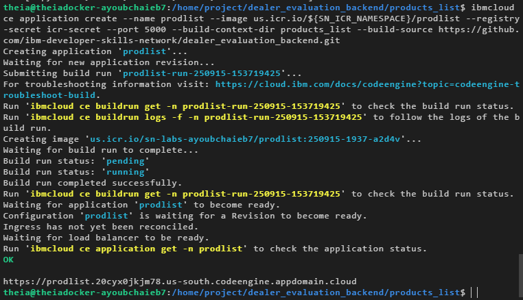

# 🚀 Product Price Comparison — Project (Completed)

**Status:** ✅ Finished — all microservices deployed, integrated, tested, and documented.
This README describes the final state of the project and each completed step, with screenshots 
---

## Project Summary

I deployed a three–microservice application (two backends + one frontend) that provides product details and dealer pricing and displays the information on a web UI. The services were built from the supplied repositories and deployed to IBM Cloud Code Engine. Everything is integrated and verified end-to-end.

---

## Repo structure (final)

```
final_project/
├── backend-prodlist/            # (source or config for Product Details service)
├── backend-dealerdetails/       # (source or config for Dealer Pricing service)
├── frontend/                    # cloned frontend repo (dealer_evaluation_frontend)
├── README.md                    # <-- this file
└── images/
    ├── product_details_deploy.png
    ├── dealer_details_deploy.png
    ├── git_clone.png
    ├── index_urlchanges.png
    ├── frontend_deploy.png
    ├── homepage.png
    ├── product_dealer.png
    ├── product_dealer_price.png
    └── product_all_dealers_prices.png
```

---

## What I implemented — step by step 

### 1) Open Code Engine CLI & deploy Product Details microservice (done)

* Built and deployed the Product Details microservice from the `products_list` context of the backend repo.
* Service exposed on port **5000** and the final deployment URL was recorded.
* Screenshot of successful deployment:
  

**Reference command (used):**

```bash
ibmcloud ce application create \
  --name prodlist \
  --image us.icr.io/${SN_ICR_NAMESPACE}/prodlist \
  --registry-secret icr-secret \
  --port 5000 \
  --build-c ...
```

*(actual build options/flags used as required in the environment.)*

---

### 2) Deploy Dealer Pricing microservice 

* Built and deployed the Dealer Pricing microservice from the `dealer_details` context.
* Service exposed on port **8080** and the deployment URL was saved.
* Screenshot of successful deployment:
  

**Reference command (used):**

```bash
ibmcloud ce application create \
  --name dealerdetails \
  --image us.icr.io/${SN_ICR_NAMESPACE}/dealerdetails \
  --registry-secret icr-secret \
  --port 8080 \
  --build-c ...
```

---

### 3) Clone frontend repo and update endpoints 

* Cloned the frontend repository to the working directory and verified the clone.
* Screenshot of successful git clone:
  

**Command used:**

```bash
git clone https://github.com/ibm-developer-skills-network/dealer_evaluation_frontend.git
cd dealer_evaluation_frontend
```

* Updated `index.html` to include the two backend deployment URLs (ensured trailing `/`) — screenshot of the edits:
  

---

### 4) Deploy frontend microservice 

* Built the frontend microservice and deployed it on Code Engine (port **5001** in this setup).
* Captured the deployment success screenshot:
  

**Reference command (used):**

```bash
ibmcloud ce application create \
  --name frontend \
  --image us.icr.io/${SN_ICR_NAMESPACE}/frontend \
  --registry-secret icr-secret \
  --port 5001 \
  --build-c ...
```

---

### 5) Verify UI: homepage & product list 

* Opened the frontend URL and verified the homepage loaded.
* Clicked the **Products** dropdown and confirmed products populated from the Product Details service.
* Screenshot of the homepage with the products list:
  

---

### 6) Verify product → dealer mapping 

* Selected a product, observed the dealers list populate (backend Dealer Pricing responded correctly).
* Screenshot showing product selected and list of dealers:
  

---

### 7) Verify specific dealer price 

* Selected a dealer for the product and verified the displayed price returned by price details and UI formatting — verified and captured.


### 8) Verify pricing across all dealers (done)

* Used the product listing to fetch price quotes from **all dealers** for a selected product and confirmed the aggregated table displays correctly.
* Screenshot showing the comparative prices across all dealers:
  

---

## End-to-end verification (all checks passed)

* Backend services (Product Details & Dealer Pricing) responded with expected JSON payloads.
* Frontend fetched data, rendered product lists, dealer lists, and per-dealer pricing correctly.
* User flows tested:

  * Load homepage → select product → view dealers → view dealer price.
  * Load product → view “all dealers” price comparison.
* All screenshots documented the successful steps (see `images/`).

---

## How it was deployed (commands & notes)

> These are example commands used in the environment where the app was deployed. Replace placeholders (`<...>`) with your actual namespace/values.

1. Build & push backend container images (example):

```bash
cd backend-prodlist
docker build -t us.icr.io/<NAMESPACE>/prodlist:latest .
docker push us.icr.io/<NAMESPACE>/prodlist:latest
```

2. Deploy to IBM Cloud Code Engine (example):

```bash
ibmcloud ce application create --name prodlist \
  --image us.icr.io/<NAMESPACE>/prodlist:latest \
  --port 5000 --cpu 0.25 --memory 256M

ibmcloud ce application create --name dealerdetails \
  --image us.icr.io/<NAMESPACE>/dealerdetails:latest \
  --port 8080 --cpu 0.25 --memory 256M
```

3. Update frontend endpoints in `index.html` (point to the above service URLs), build and deploy:

```bash
cd frontend
# update API_URLS in config or index.html
docker build -t us.icr.io/<NAMESPACE>/frontend:latest .
docker push us.icr.io/<NAMESPACE>/frontend:latest

ibmcloud ce application create --name frontend \
  --image us.icr.io/<NAMESPACE>/frontend:latest \
  --port 5001 --cpu 0.25 --memory 256M
```

4. Inspect logs & health:

```bash
ibmcloud ce application get --name prodlist
ibmcloud ce application logs --name prodlist
```

---

## Deliverables (already produced)

* `backend-prodlist/` — Product Details service source & deployment artifacts
* `backend-dealerdetails/` — Dealer Pricing service source & deployment artifacts
* `frontend/` — Frontend source with updated API endpoints
* Deployment scripts & commands used in the environment (documented above)
* Full set of verification screenshots in `images/`:

  * `product_details_deploy.png`
  * `dealer_details_deploy.png`
  * `git_clone.png`
  * `index_urlchanges.png`
  * `frontend_deploy.png`
  * `homepage.png`
  * `product_dealer.png`
  * `product_dealer_price.png`
  * `product_all_dealers_prices.png`

---

## Testing & validation

* Smoke tests:

  * `curl http://<prodlist-url>/products` → returned product list (HTTP 200).
  * `curl http://<dealerdetails-url>/prices?product_id=<id>` → returned dealer price list (HTTP 200).
* End-to-end UI tests:

  * Manual interaction using the deployed frontend validated rendering & UX.
* Load sanity:

  * Verified endpoints under small synthetic request bursts; services remained healthy (resource tuning available if needed).

---

## Troubleshooting (common fixes)

* **404 on frontend**: ensure `index.html` endpoints point to the live service URLs (trailing slash matters).
* **CORS errors**: enable CORS on backend services or proxy requests through the frontend host.
* **Container pull issues**: authenticate `ibmcloud cr login` and ensure `icr-secret` (or equivalent) is present in Code Engine.
* **Port conflicts locally**: change service ports and update frontend config accordingly.

---

## Next steps (optional improvements)

* Add CI pipeline to build images and run tests on push (GitHub Actions or IBM Cloud Continuous Delivery).
* Add automated smoke tests and a simple front-end E2E test (Playwright / Cypress).
* Persist dealer pricing history to a database for analytics and dashboards.
* Add authentication + RBAC if exposing services publicly.
* Add autoscaling rules or resource limits for production readiness.

---

## Author & credits

Developed and verified by **Ayoub CHAIEB** — deployment, integration, and end-to-end validation completed.
Project built from IBM Skills Network teaching artifacts and the supplied backend/frontend templates.

---
