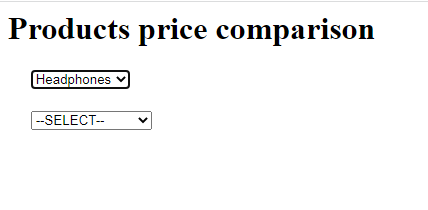

# 🚀 Product Price Comparison — Project (Completed)

**Status:** ✅ Finished — all microservices deployed, integrated, tested, and documented.
This README describes the final state of the project and each completed step, with screenshots 
---

## Project Summary

I deployed a three–microservice application (two backends + one frontend) that provides product details and dealer pricing and displays the information on a web UI. The services were built from the supplied repositories and deployed to IBM Cloud Code Engine. Everything is integrated and verified end-to-end.

---

## Repo structure (final)

```
final_project/
├── backend-prodlist/            # (source or config for Product Details service)
├── backend-dealerdetails/       # (source or config for Dealer Pricing service)
├── frontend/                    # cloned frontend repo (dealer_evaluation_frontend)
├── README.md                    # <-- this file
└── images/
    ├── product_details_deploy.png
    ├── dealer_details_deploy.png
    ├── git_clone.png
    ├── index_urlchanges.png
    ├── frontend_deploy.png
    ├── homepage.png
    ├── product_dealer.png
    ├── product_dealer_price.png
    └── product_all_dealers_prices.png
```

---

## What I implemented — step by step 

### 1) Open Code Engine CLI & deploy Product Details microservice (done)

* Built and deployed the Product Details microservice from the `products_list` context of the backend repo.
* Service exposed on port **5000** and the final deployment URL was recorded.
* Screenshot of successful deployment:
  

**Reference command (used):**

```bash
ibmcloud ce application create \
  --name prodlist \
  --image us.icr.io/${SN_ICR_NAMESPACE}/prodlist \
  --registry-secret icr-secret \
  --port 5000 \
  --build-c ...
```

*(actual build options/flags used as required in the environment.)*

---

### 2) Deploy Dealer Pricing microservice 

* Built and deployed the Dealer Pricing microservice from the `dealer_details` context.
* Service exposed on port **8080** and the deployment URL was saved.
* Screenshot of successful deployment:
  

**Reference command (used):**

```bash
ibmcloud ce application create \
  --name dealerdetails \
  --image us.icr.io/${SN_ICR_NAMESPACE}/dealerdetails \
  --registry-secret icr-secret \
  --port 8080 \
  --build-c ...
```

---

### 3) Clone frontend repo and update endpoints 

* Cloned the frontend repository to the working directory and verified the clone.
* Screenshot of successful git clone:
  

**Command used:**

```bash
git clone https://github.com/ibm-developer-skills-network/dealer_evaluation_frontend.git
cd dealer_evaluation_frontend
```

* Updated `index.html` to include the two backend deployment URLs (ensured trailing `/`) — screenshot of the edits:
  

---

### 4) Deploy frontend microservice 

* Built the frontend microservice and deployed it on Code Engine (port **5001** in this setup).
* Captured the deployment success screenshot:
  

**Reference command (used):**

```bash
ibmcloud ce application create \
  --name frontend \
  --image us.icr.io/${SN_ICR_NAMESPACE}/frontend \
  --registry-secret icr-secret \
  --port 5001 \
  --build-c ...
```

---

### 5) Verify UI: homepage & product list 

* Opened the frontend URL and verified the homepage loaded.
* Clicked the **Products** dropdown and confirmed products populated from the Product Details service.
* Screenshot of the homepage with the products list:
  

---

### 6) Verify product → dealer mapping 

* Selected a product, observed the dealers list populate (backend Dealer Pricing responded correctly).
* Screenshot showing product selected and list of dealers:
  

---

### 7) Verify specific dealer price 

* Selected a dealer for the product and verified the displayed price returned by
